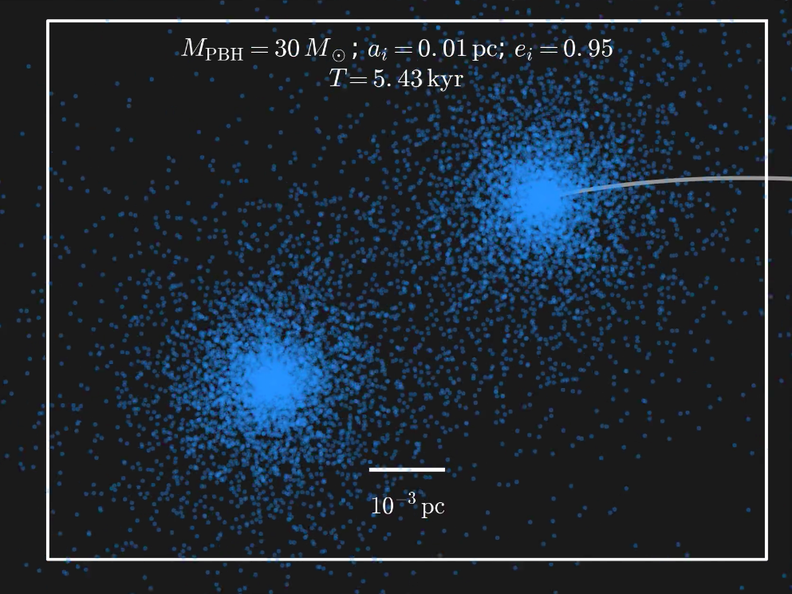
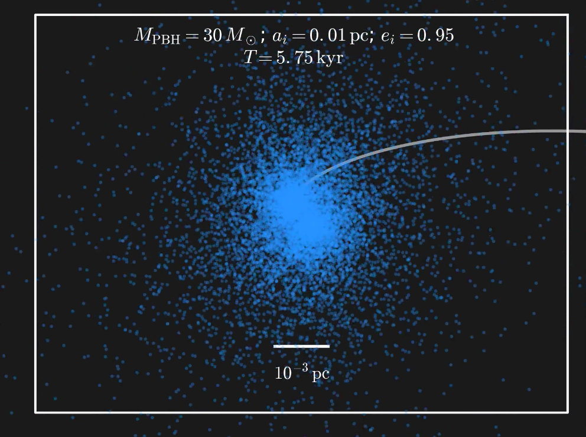

# BlackHolesDarkDress

  

Code for studying primordial black hole (PBH) binaries, clothed in dark matter (DM) halos, associated with the paper "*Black Holes' Dark Dress: On the merger rate of a subdominant population of primordial black holes*". We use N-body simulations (along with analytical estimates) to follow the evolution of PBH binaries formed in the early Universe. **Movies are available [here](movies/) (archived on [FigShare](https://doi.org/10.6084/m9.figshare.6298397)).**

  

The main calculations are given in [`notebooks/MergerRate.ipynb`](notebooks/MergerRate.ipynb) and [`notebooks/LIGO_limits.ipynb`](notebooks/LIGO_limits.ipynb). Code and information about the N-body simulations are in the folder [`Nbody/`](Nbody/).

If you have any questions, comments, bug-reports etc., please contact Bradley Kavanagh at bradkav@gmail.com. 

## Contents

The code, plots, data-products, etc. are arranged as follows:

* `Nbody/` - Code for setting up, running and analysing the Gadget-2 simulations. Note that the snapshot files are stored on FigShare - [https://doi.org/10.6084/m9.figshare.6300110](https://doi.org/10.6084/m9.figshare.6300110) - and there are a couple of scripts in this folder for downloading and unpacking them.
* `movies/` - Animations of selected N-body simulations.
* `plots/` - Plots associated with the code and paper. Some of the plots appearing here do not feature in the paper, but we provide them for extra information.
* `data/` - Some data files which are needed for calculating limits (sensitivity curves, etc.). Our limits on the PBH fraction from LIGO observations are in tabulated `data/LIGO_limit_f.txt/`.
* `notebooks/` - Contains jupyter notebooks for performing the main calculations in the paper associated with the PDFs of binary system, as well as calculating the merger rates and LIGO limits.

Summary of main notebooks (so far):

* `notebooks/RemappingExamples.ipynb` - Example of how the remapping works, including a plot of the final semi-major axis as a function of initial semi-major axis
* `notebooks/LIGO_sensitivities.ipynb` - Notebook for estimating the LIGO sensitivity curves S(z)
* `notebooks/MergerRate.ipynb` - Notebook for calculating and plotting the distribution in (a, j) of PBH binaries, applying the remapping procedure and calculating the corresponding merger rate. Much of the code for defining the probability distributions and performing the remapping is also available as a module in `Remapping.py` and `Sampling.py`.
* `notebooks/LIGO_limits.ipynb` - Notebook calculating the upper limit on the merger rate from LIGO, for a range of BH masses.

## Requirements

The sampling routines, for generating samples of binaries, require [`emcee`](http://dfm.io/emcee/current/). In addition, we require standard numpy and scipy libraries.

Unfortunately, the notebooks and code are generally a mix of python2.7 and python3. We offer no guarantee of the 'cleanliness' of the code, but it's better than nothing ;)

## Coming soon

This repo will be updated soon with more cleaned-up code etc:

* Some of the notebooks for analysing the N-body simulation results are currently only compatible with the low-resolution simulations. This will be fixed soon. In addition, there will also be some extra notebooks for checking the stability of the DM halos in single-PBH runs.
* Notebooks for plotting the semi-major axis and truncation radius of the DM halo as a function of redshift should be added soon.
* The full script for generating the LIGO limit (and overlaying other PBH limits) should be added soon.
* Extra documentation will be added soon, detailed exactly how to make use of the initial conditions generator scripts for the Gadget-2 simulations and how to set the simulations running.

## License

This project is licensed under the MIT License - see the [LICENSE.md](LICENSE.md) file for details
